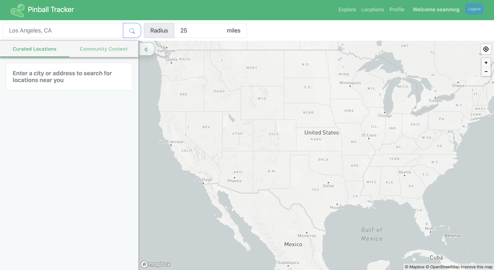
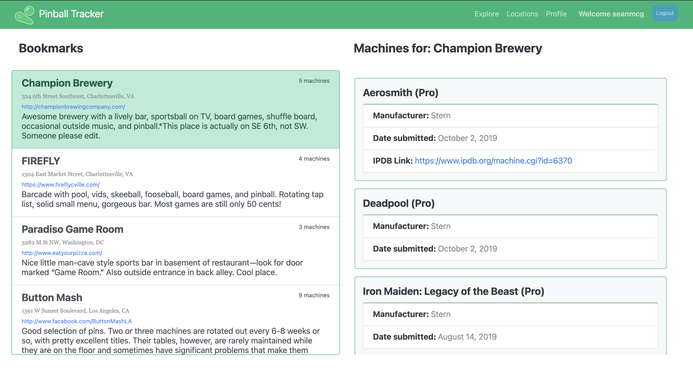
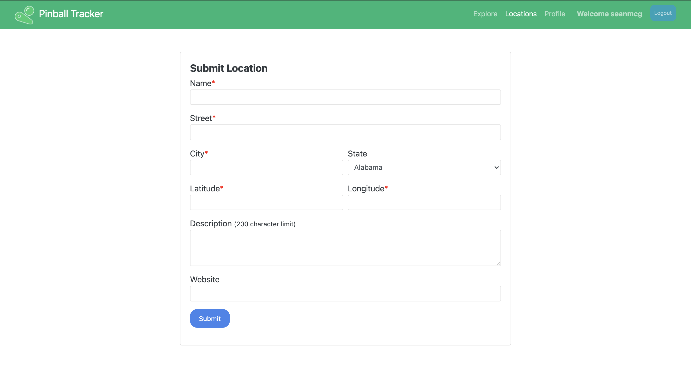
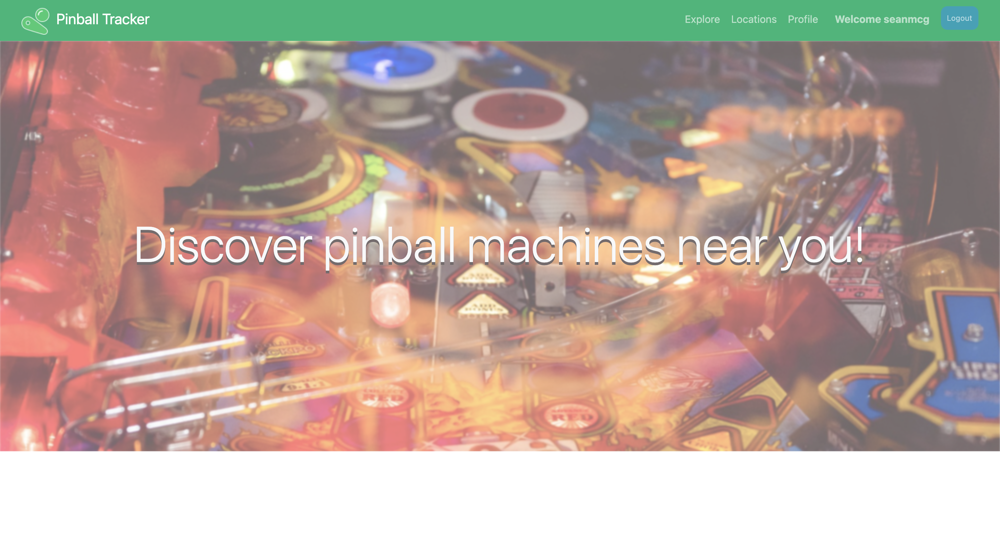

# Pinball Tracker

A Web application that allows you to search for pinball machines. You can browse through the "Curated Locations," which utilizes the locations submitted to the <a href="https://pinballmap.com/api/v1/docs/1.0">Pinball Map API</a>, or the "Community Content," which are crowdsourced locations and machines original to the Pinball Tracker. For each location you can view the machines available, as well as details on those games. Additionally, by creating an account you gain the ability to bookmark locations, saving them to your profile for easy access.

Pinball Tracker was build with React, Redux for state management, and Django REST Framework. Django-rest-knox was also used for token authentication. The application is currently deployed on Heroku at <a href="https://pinball-tracker.herokuapp.com">https://pinball-tracker.herokuapp.com</a>

# Try it out!

Start by making an account, and search for your city or address in the curated locations! Then bookmark your favorite locations, and check them out on your profile.

For now the community content is not filtered by location, as there are not too many locations to display yet.

Watch the full demo of the current state of the app on my <a href="https://youtu.be/A7WYX6Qy4VA">YouTube channel</a> 

## Browse crowdsourced locations of pinball machine

| 
| :-------------: |

## Django Rest Framework + Postgres Database lets you submit and bookmark locations

| 
| :-------------: |

| 
| :-------------: |

## Landing screen

| 
| :-------------: |
